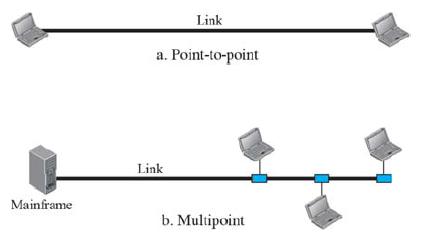

# 네트워크란?

네트워크란 노드라고 불리는 **장치**들이 통신 **링크**로 연결된 집합체를 의미한다.

장치와 링크는 각각 2개의 분류로 나뉘게 되는데 장치는 네트워크 내,외부를 기준으로, 링크는 무선, 유선을 기준으로 나뉘게 된다.

# 좋은 네트워크란?

좋은 네트워크란 우수한 **성능, 신뢰성, 보안성**을 보유한 네트워크이다.

1. 성능

   성능은 처리량과 지연 시간으로 측정된다.

   - 처리량: 단위 시간 당 얼마나 많은 트래픽을 통과시킬 수 있는가. 트래픽을 많이 처리할 수 있을수록 우수하다.
   - 경유 시간: 한 장치에서 다른 장치로 데이터가 전달되는데 걸리는 시간이다. 경유 시간이 짧을수록 우수하다.
   - 왕복 시간(RTT:Round Trip Time): 출발지에서 목적지까지 갔다가 돌아오는데 걸리는 시간. RTT가 짧을수록 우수하다.
   - 응답 시간: 요청을 받았을 떄 이에 응답에 소요되는 시간. 응답 시간이 짧을수록 우수하다.

2. 신뢰성

   장애 빈도와 장애 발생 후 회복 시간, 재난에 대한 견고성 등으로 평가된다.

3. 보안성

   네트워크에서 정보유출이나 불법적인 침입으로부터 보안이 좋을수록 우수하다.

# 통신 링크에 대해서

통신 링크는 노드 사이의 패킷을 전달하기 위해서 사용된다.
통신 링크의 방식은 2가지로 분류된다.

1. 일대일 연결(point-to-point)

   - 노드와 노드가 1개의 통신 링크에 의해서 연결되어 있는 상태
   - 보내는 사람을 받는 사람쪽에서 확실히 알 수 있다는 특징이 있다.

2. 멀티 포인트(multi-point, multi-drop)
   - 선 하나에 여러 개의 시스템이 상호 공유하는 상태

# 네트워크 토폴로지

구성 요소인 노드와 링크가 어떻게 배치되었는지를 의미한다. 총 4개로 분류된다.

1. Mesh

   여러 장치들이 상관성 없이 연결되어있는 구조.

   완전 메시형과 부분 메시형이 있다. 완전 메시형은 모든 노드들끼리 일대일로 연결된 구조이고, 부분 메시형은 2-3개의 장치들과만 연결된다.

   장점: 안정성과 보안성이 뛰어나고, 매우 많은 연결을 지니고 있기에 한 노드가 고장난다고 해도 네트워크가 먹통이 되는 일은 발생하지 않는다.

   단점: 비싸다. 모든 노드를 연결하려면 케이블이 그만큼 많이들고 설치하는데 시간이 오래걸린다. 노드를 추가할수록 케이블에 드는 비용이 기하급수적으로 증가한다.

2. Star

   허브라고 하는 통신 장비가 필수적으로 존재한다. 컴퓨터를 케이블을 통해 허브와 일대일로 연결한다.
   허브를 중심으로 컴퓨터 배치 모양이 별과 같다하여 스타 토폴로지라고 한다. 가장 흔하게 이용되는 토폴로지이다.

   장점: 각각의 노드는 중앙 허브로부터 독립적으로 연결되어 있어서, 노드에 이상이 발생해도 다른 노드에 미치는 영향이 없다. 메시 토폴로지와 다르게 네트워크를 구성하는데 상대적으로 적은 케이블을 사용하기에 확장하거나 줄여나갈 때 유리하다.

   단점: 중앙 허브가 다운되면 전체 네트워크가 먹통이 된다.

3. Bus

   케이블 하나를 여러개의 시스템이 공유하는 구조.
   하나의 긴 케이블에 여러 장치들이 멀티 포인트 링크 형태로 연결되어있다.

   장점: 네트워크 배치가 단순하여 모든 장치가 하나의 케이블로 연결되기 때문에 비용이 효율적이다. 소규모 네트워크에 적합하다.

   단점: 케이블이 고장나면 먹통이 된다. 버스 토폴로지는 기본적으로 높은 대역폭을 가지지만, 노드가 추가될수록 대역폭이 낭비되어 데이터 전송 속도가 느려진다. 따라서 소규모 네트워크에 적합하다.

4. Ring

   링의 형태(원형)로 구성되어있는 구조. 데이터가 링을 따라서 한 방향, 또는 양방향으로 흐르며 좌,우 이웃 노드가 반드시 존재한다.

   장점: 한번에 하나의 노드에서만 데이터 전송이 가능하기에 패킷 충돌 위험이 없기에 데이터를 오류없이 잘 전달할 수 있다. 설치 비용이 저렴하고 문제가 있는 노드를 쉽게 알 수 있다.

   단점: 데이터를 전달할 때 목적지 노드에 도착하기 위해서 중간 노드를 경유하는데 이런 특징 때문에 노드 하나에 문제가 발생하면 전체 네트워크가 먹통이 될 수 있다. 노드를 추가 또는 제거하기 위해서는 전체 네트워크를 중단해야한다. 원이 끊어지기 때문이다.

5. Tree

   스타 토폴로지는 각각의 노드가 허브에 직접적으로 연결되었지만, 트리 토폴로지에서 노드는 부모-자식 계층 구조로 연결되어 있다. 스타 토폴로지와 버스 토폴로지가 결합된 구조이다.

   장점: 스타, 버스 토폴로지와 마찬가지로 노드의 추가와 네트워크 확장에 용이하다.

   단점: 중앙 허브가 고장나면 먹통이 된다. 계층 구조로 이루어졌기 때문에 추가되는 노드가 많아질수록 관리가 어려워지고 케이블 양이 많이들어 비용이 높아진다.

실제로 사용되는 네트워크 토폴리지는 여러 구조를 결합한 복잡한 구조를 갖고 있다.

# 네트워크 분류

네트워크는 크기, 소유권, 구조 등에 의해서 분류한다.

1. LAN(Local-area network)

   Local의 기준을 어떻게 잡을지는 사실 애매하다. LAN에 속하는 네트워크는 소유주가 개인이라는 특징을 통해서 기준을 생각해볼 수 있다. 집, 사무실, 한 층, 한 캠퍼스, 한 건물을 등 개인이 소유한 네트워크의 범위를 로컬 area라고 간주할 수 있다.

2. MAN(Metropolitan-area network)

   metropolitan라는 단어의 뜻에 맞게 한 도시 정도를 커버하는 영역의 네트워크를 말한다. 링 토폴로지 형태를 띈다.

3. WAN(Wide-area network)

   전국, 전세계 규모의 굉장히 광범위한 네트워크로 인터넷이 여기에 속한다.

# 참고

[쉽게 배우는 네트워크 1강](https://www.youtube.com/watch?v=D9KKEKETLmI&list=PLFpZ7zSiHhPxrib8i4XPRKxB6FR9_NlCo)

https://www.edrawsoft.com/kr/for-beginners/what-is-network-topology.html
