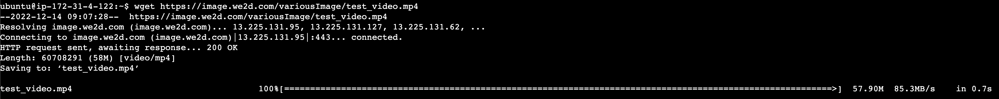
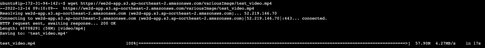
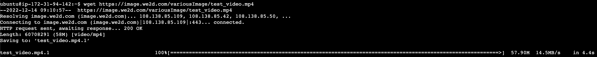
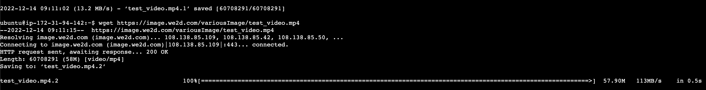

# cdn이란?

cdn이란 content delivery network의 약어로 빠른 콘텐츠 전달을 목적으로 고안되었다.
엔드 유저와 서버 사이의 물리적인 거리를 줄여서 콘텐츠 로딩에 소요되는 시간을 최소화한다.

전세계에 캐시 서버를 분산 배치하여 엔드 유저의 요청에 **오리진 서버가 아닌 엔드 유저에 근접한 캐시 서버가 콘텐츠를 전송한다.** 거리가 먼 오리진 서버가 아닌, 가까운 캐시 서버에서 콘텐츠를 받아오기 때문에 로딩에 소요되는 시간을 획기적으로 줄일 수 있는 것이다.

예시로 캐나다에 있는 유저가 한국에 있는 서비스에 접근하다면, 캐나다에 위치한 캐시 서버에서 캐싱된 콘텐츠를 전송하여 빠르게 콘텐츠를 받아올 수 있다.

# cdn 적용 유무에 따른 속도 차이

속도 차이가 얼마나 나는지 궁금해서 직접 실험을 해봤다.
AWS EC2 인스턴스를 각각 서울, 미국 버지니아 북부 지역에 생성하였고 서울에 위치하는 S3 버킷의 동영상을 다운로드 받아봤다. CDN은 AWS Cloudfront 서비스를 이용했다.

서울에 위치하는 EC2에서 실험을 해봤을 때 cdn 적용 유무에 따라 차이가 없었다.

cdn이 적용되었을 때와 적용되지 않았을 때 0.7s로 동일하였다. 위의 예시는 cdn을 적용하였을 때 다운로드 속도이다.

미국 버지니아 북부 지역에서 실험을 해봤을 때는 cdn 적용 유무에 따라 유의미한 차이가 있었다.

1. 버지니아 리전에서 cdn이 아닌 S3(오리진 서버)로 직접 접속하여 다운 받았을 떄
   
   17초가 걸렸다.

2. 버지니아 리전에서 cdn을 적용하여 처음 다운로드 받았을 때
   
   4.4초가 걸렸다.

3. 버지니아 리전에서 cdn을 적용하여 두번 째 다운로드 받았을 때(캐싱된 상태)
   
   0.5초가 걸렸다.

우선 서울에서 서울에 위치하는 오리진 서버로부터 다운로드 받았을 때와 미국에서 서울에 위치하는 오리진 서버로부터 다운로드 받았을 때의 차이를 비교해본다.

17초와 0.7초로 매우 많이 차이가 난다는 것을 알 수 있다. 서버와의 물리적인 거리가 멀어질수록 전송 속도가 느려진다는 것을 파악했다.

이번에는 미국에서 오리진 서버로부터 다운로드 받았을 떄와 cdn을 적용했을 때 차이를 비교해본다.

1. 1번 케이스 vs 3번 케이스

   왜 cdn을 적용해야 하는지 보여준다. 17초와 0.5초로 속도 차이가 매우 큰 것을 알 수 있다. 전세계를 대상으로 하는 서비스라면 cdn을 적용하는게 훨씬 좋은 사용자 경험을 제공할 것이다.

2. 2번 케이스 vs 3번 케이스

   캐시 서버에 콘텐츠가 캐싱이 되어 있지 않을 때와 캐싱이 되어 있을 때 비교이다. 2번 케이스의 경우 캐시 서버에 콘텐츠가 없어서 오리진 서버로부터 콘텐츠를 가져와서 캐싱 후 요청에 응답한다. 이를 cache miss라고 한다. 3번 케이스의 경우 캐싱이 된 상태이므로 오리진 서버로부터 콘텐츠를 요청하지 않고 바로 캐시 서버에서 응답한다. 이를 cache hit라고 한다. cache hit의 경우 오리진 서버를 거치지 않기 때문에 속도가 더 빠르다.

3. 1번 케이스 vs 2번 케이스

   1번 케이스와 2번 케이스 모두 오리진 서버로부터 데이터를 요청한다. 하지만 cdn을 이용하는 2번 케이스의 경우 1번 케이스 대비 약 13초나 빠르게 콘텐츠를 다운로드 하였다. 이번 비교를 통해서 캐싱된 콘텐츠를 반환하는 것이 아닌 매번 오리진을 거쳐야 하는 동적인 콘텐츠를 전달할 때도 cdn을 사용하면 좋다는 것을 알 수 있다. 어떻게 이런 일이 가능한 것일까?

   우리가 잘아는 KT와 같은 ISP(Internet Service Provider)들 간의 연결(ISP-ISP)은 경제적인 논리에 의해서 이루어져 있다. 따라서 항상 최적화된 라우팅 경로를 제공하는 것은 아니다.
   하지만 전세계에 깔린 cdn 서버들은 많은 네트워크 통신을 하다보니 많은 데이터가 쌓이게 되었고 최적화된 라우팅 경로를 파악하여 제공할 수 있게 되었다. cdn은 라우팅을 최적화하여 다운로드 시간을 단축시킨다.

   AWS의 Cloudfront의 경우에는 원본과의 지속적인 유지, gzip 압축을 사용함으로써 시간을 추가적으로 단축한다고 한다. 원본과의 지속적인 유지란, connectionless라는 HTTP의 특징과 반하는 개념으로 콘텐츠를 다운로드 받고도 지속적으로 연결을 유지하는 것을 의미한다. IP 기반의 네트워크를 통해서 TCP/IP 연결을 하기 위해서는 3 way handshake 과정을 거쳐야 하는데 이 과정에 필요한 패킷 사이즈는 크지 않아서 사실 큰 오버헤드는 아니다. 하지만 거리가 멀어질수록 round-trip time이 길어짐으로써 큰 오버헤드가 될 수 있다. 원본과의 유지를 지속함으로써 초기 연결에 필요한 시간을 세이브 할 수 있다. 초당 요청 건수가 많을수록 큰 효과를 누릴 수 있다.

   gzip은 전송되는 데이터 크기를 줄여서 트래픽을 줄일 수 있다. 데이터를 더 짧은 시간안에 전송할 뿐만 아니라 데이터 전송 비용도 절감할 수 있다.

# cdn의 속도 이외의 기능

cdn을 활용하면 콘텐츠를 빠르게 전달한다는 장점 이외에도 요청을 여러개의 서버로 분산시킬 수 있으므로 대역폭 소비를 줄이며 안정적인 서비스 제공이 가능하다.

극단적인 예시로는 DDOS 공격에 대한 방어인데, DDOS 공격이란 좀비 pc를 사용하여 특정 서비스에 엄청난 트래픽을 발생시켜서 서비스를 무력화 시키는 것을 말한다.

CDN이 요청을 분산하여 오리진 서버에 미치는 영향을 줄임으로써 트래픽 급증에 대처할 수 있다. 만일 한국 캐시 서버의 요청이 너무 많다면, 옆에 도쿄로 분산시키고, 도쿄도 많다면 홍콩으로 분산시키고.. 이러한 방식으로 전세계에 배치된 캐시 서버를 활용하여 요청을 분산시킨다. 또한 사용자 위치에 따라 접근을 제어하거나 너무 빠르거나 느린 요청을 차단함으로써 요청을 줄인다고 한다.

# 캐싱 관리

## 캐싱 만료 주기

CDN 서비스를 이용할 때 기본적으로 캐싱의 만료 주기(TTL)를 설정할 수 있다.

요청을 받았을 때, 캐시 서버에 저장된 콘텐츠가 만료되었다면 캐시 서버는 원본 서버에 데이터가 변경되었는지 유효성을 검증한다. 변경되지 않았다면 HTTP 304(not modified) 응답을 받게되고 캐싱으로 저장된 콘텐츠를 수정하지 않고 TTL만 갱신하여 요청에 응답한다. 이를 Cache Refresh Hit이라고 한다. 만일 변경되었다는 HTTP 200 응답을 받게되면 오리진 서버로부터 콘텐츠를 다운로드받고 해당 콘텐츠로 캐싱을 갱신하여 요청에 응답한다. 이를 Cache Refresh Miss라고 한다.

## 캐싱의 만료 주기가 끝나기 전에 콘텐츠 수정이 일어난다면?

캐싱의 만료 주기가 끝나기 전에, 콘텐츠의 수정이 일어나게 된다면 캐시 서버는 변경되기 전의 콘텐츠를 제공할 것이다.

위와 같은 문제는 2가지 전략으로 해결할 수 있다.

1. 캐시 서버에 캐싱된 콘텐츠를 강제로 삭제한다.

   캐싱된 콘텐츠를 강제로 삭제함으로써 캐시 서버는 오리진 서버에 새롭게 콘텐츠를 요청하여 받아온다. 만일 캐싱된 콘텐츠가 사용령이 많다면 순간적으로 오리진 서버에 부하가 올 수 있으므로 사용에 유의해야 한다. 또한 사용자 단의(브라우저 등) 로컬 캐시된 콘텐츠의 갱신을 보장하지 않는다.

2. 콘텐츠를 다른 이름으로 저장한다.

   이 방식은 사용자 단의 콘텐츠의 최신성을 보장해줄 수 있다. AWS에서는 파일을 버전관리 함으로써 이 전략을 수행하도록 권장한다.

   캐싱의 기준은 콘텐츠가 아닌 URL 기반이기 때문에 쿼리스트링이 추가될 수 있다. 동일 콘텐츠임에도 불구하고 쿼리스트링이 달라짐으로써 캐싱이 안될수도 있으니 잘 설정해주어야 한다.

# 어떻게 가까운 곳을 찾아서 전달할 수 있을까?

CDN은 엔드 유저의 요청에서 가장 가까운 캐시 서버의 캐싱된 콘텐츠를 반환함으로써 빠른 다운로드 속도를 제공한다고 했다. 그렇다면 어떻게 엔드 유저와 가까운 캐시 서버를 알 수 있을까? 이는 라우팅의 원리를 알아야한다.

## 라우팅 테이블

라우팅은 네트워크에서 경로를 선택하는 프로세스이다. 쉽게 말하면 라우터에서 라우터로 이동하면서 목적지 주소를 찾는 과정을 말한다. 목적지 주소가 라우터와 동일한 네트워크에 있을 경우 패킷을 직접 전달하는 것으로 마무리된다.

라우터에서 라우터로 이동할 때 라우팅 테이블이라는 표를 보고 움직이게 된다. 라우팅 테이블에는 최적의 경로로 도달할 수 있는 다음 라우터의 네트워크 주소만 명시되어있다.

동일한 네트워크에 연결된 컴퓨터 하나하나 모두 명시하는게 아니라 네트워크 주소만 명시하는 이유는 테이블의 크기를 줄이기 위함이다. 테이블 크기를 줄임으로써 검색도 빨라지고 메모리 낭비도 줄일 수 있다.

라우팅 테이블에는 모든 경로에 대한 네트워크 주소가 들어가있는게 아니고 다음 라우터에 대한 네트워크 주소만 들어가있다. 그 이유는 다음 라우터 네트워크 주소만 들어가 있어도 차례대로 이동하면서 목적지에 도착할 수 있기 때문이다. 굳이 모든 경로에 대한 네트워크 주소를 명시함으로써 메모리 낭비를 할 필요가 없다.

### 그렇다면 라우팅 테이블은 어떻게 구성되는 것일까?

라우팅 테이블을 구성하는 방법은 2가지이다.

1. 정적 라우팅 테이블

   직접 사용자가 라우팅 테이블을 입력해준다.
   네트워크에 붙어 있는 마지막 컴퓨터들이 정적 라우팅을 하는 경우가 대부분이다. 혹은 보안적으로 어떤 목적이 있거나.

2. 동적 라우팅 테이블

   라우팅 프로토콜에 의해서 동적으로 구성된다.

   유니캐스트 라우팅 프로토콜: 일대일 통신을 말한다. 보내는 사람도 하나, 받는 사람도 하나

   멀티캐스트 라우팅 프로토콜: 보내는 사람은 하나인데 받는 사람 여려명

## 라우팅 프로토콜

최적화된 라우팅 테이블을 만드는데 라우팅 프로토콜이 사용된다.

라우팅 프로토콜은 내부 게이트웨이 프로토콜과 외부 게이트웨이 프로토콜로 나누어진다. 나누는 기준은 AS이며 AS(Autonomous System)는 독립적인 네트워크로 라우팅 정보를 주고 받을 수 있는 영역이며 2가지 특징을 가진다.

1. AS 내의 라우터들은 서로 동일한 라우팅 프로토콜을 사용한다.
2. AS 내의 라우터들은 한 조직에 의해 관리된다.

### 내부 프로토콜

내부 프로토콜에는 Distance Vector 알고리즘, Link State 알고리즘이 사용된다.

1. Distance Vector 알고리즘

   최소 경로를 계산하기 위해서 벨만 포드 알고리즘을 사용한다.
   벨만 포드 알고리즘을 사용하는 이유는 음의 간선이 존재해서가 아니라 본인이 가진 네트워크 정보를 이웃하고만 교환하는 방식이기 떄문이라고 생각한다.

2. Link State 알고리즘

   본인으로부터 모든 목적지까지 가는 최단 경로를 구한다. 다익스트라 알고리즘을 사용한다.
   다익스트라 알고리즘을 사용하는 이유는 이웃 이외에도 모든 노드와 네트워크 정보를 교환하기 때문이다. 모든 정보를 알고있다면 다익스트라 알고리즘이 시간복잡도에서 효율적이다.

### 외부 프로토콜

외부 프로토콜은 경로 벡터 라우팅이라는 방식에 의해서 수행된다.

경로 벡터 라우팅에는 목적지 네트워크, 다음 라우터, 경로명이 명시된다. Distance Vector 알고리즘 기반으로 작동하고 looping 되는 경로를 방지하기 위해 모든 path를 명시한다.
