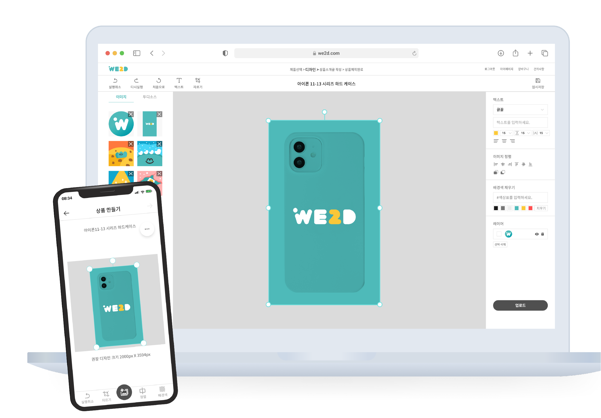

# 프로젝트 설명

canvas api를 사용하여 웹 브라우저에서 이미지 편집 등 간단한 포토샵 기능을 사용할 수 있는 프로젝트이다.


이전에 위투디 프로젝트를 했을 때 구현 했었지만, 기술적으로 어려웠고 코드가 깔끔하지 않아서 언젠가 다시 만들어봐야 겠다고 생각했다.

약 1년이 지나 다시 만들어보면서 느낀 점을 기록한 글이다.

# 프로젝트 목표

1. 깊게 고민하고 코드 작성하기.

   키보드에 손을 올리기 전에, 검색하기 전에 깊게 고민해야한다. 이 프로젝트의 목표는 단순히 구현이 아니라, 정교한 설계 및 깔끔한 코드를 작성하는 방법을 연습하기 위함이다.

2. 테스트 코드 작성하기.

   코드가 정상적으로 동작하는지 확인하기 위해서, 코드 변경이나 리팩토링 시에 사이드 이펙트를 줄이기 위해서 등 테스트 코드를 작성해야 하는 이유는 많지만 지금까지 작성하지 않았다.

   고객에게 테스트해보고 빠르게 요구에 맞게 변경해야해서 코드의 생존기간이 길지 않았고 무엇보다 테스트 코드를 작성하는 것이 귀찮다고 생각했다. 테스트 코드를 작성해보면서 필요성과 장점을 느껴봐야한다.

3. 소프트웨어 비즈니스.

   프로젝트의 첫 번째 목표는 개발 실력 향상이지만, 프로젝트를 활용하여 간단한 비즈니스를 할 수 있어보인다.

   프로젝트와 유사한 소프트웨어를 인쇄업계에 제공하는 업체가 있는데 구독 가격이 월 16만 5천원이다. 에디터의 수준도 그리 높지 않아보이고 무엇보다 인쇄업체 사장님들에게는 너무 비싸다. 또한 해당 업체의 연 매출은 약 20억으로, 잘하면 어느 정도의 고정 수입을 만들 수 있어보인다.

# 고민했던 순간들

## 프로젝트 구조에 대해서

데스크탑 환경일 때, 모바일 환경일 때 UI가 많이 다름에따라 컴포넌트 배치가 달라질 것으로 예상했다. 컴포넌트 간의 의존성을 줄이고 유연하게 합성할 수 있으면 좋겠다고 생각했다.

따라서 전체적인 시스템을 compound component 형태로 제작하였다. compound component는 암묵적으로 상태를 공유하여 컴포넌트 간의 의존성을 줄여 유연한 컴포넌트 조합을 가능하게 한다.

상태를 공유하기 위해서 상태 관리 도구가 필요하였는데 recoil을 사용하였다. 보통의 compound component 패턴은 context api를 사용하지만, 컴포넌트를 합성하는 규모가 커서 불필요한 리렌더링이 많이 발생할 것으로 예상하여 recoil을 사용하였다.

많은 상태 관리 도구 중 recoil을 사용한 이유는 가장 리액트스러운 방식으로 상태를 관리하며 최소한의 데이터만 atom에 저장하며 selector를 이용하여 파생 데이터를 관리하는 점이 마음에 들었다.

## 컴포넌트의 재사용성과 관심사의 분리에 대해서. (컴포넌트의 props)

컴포넌트에서 props가 정의되는 이유는 2가지라고 생각한다.

1. 재사용성을 위해서

   특정 로직에 의존할수록 재사용성은 떨어진다. 컴포넌트의 재사용성을 높이기 위해서 컴포넌트 내부에 상태나 특정한 로직이 존재하지 않고, props를 통해서 주입받는다.

2. 관심사의 분리를 위해서

   컴포넌트가 비대할 경우 우리는 컴포넌트를 쪼갠다. 추상화 수준을 높이고 관심사를 분리하기 위해서이다. (하나의 컴포넌트는 하나의 관심사만 가지거나, 이들의 조합으로 이루어져야 한다)

   이 경우 props는 상태를 공유받기 위해서 사용된다. 쪼개진 컴포넌트는 부모 컴포넌트에 종속되며 거의 다른 컴포넌트에서 재사용되지 않는다.

컴포넌트에서 props를 정의할 때 이유를 생각하며 정의해야 관심사를 분리할 수 있다.
컴포넌트에서 props를 정의할 때 어떤 이유로 정의되었는지 생각해야 올바르게 정의할 수 있다.

다음 예시는 프로젝트에서 사용된 Stage 컴포넌트인데 canvas 태그를 만드는 역할을 수행한다.

관심사의 분리에 맞게 쪼개진 것들은 해당 로직에 관련된 API를 컴포넌트 내부에 포함해야한다. 재사용성이 없기 떄문이다.

isTriggeredDownload라는 recoil state가 왜 직접적으로 정의되었는지 작성해보자.

컴포넌트의 props는 재사용성을 위한 관점, 관심사의 분리를 위한 관점 2가지가 있다고 생각한다.

컴포넌트의 재사용성을 높이려면 제어의 역전이 필요하다. 특정 로직에 의존할수록 재사용성은 떨어지기 때문이다. 컴포넌트 내부에 상태나 특정한 로직이 존재하지 않고, props를 통해서 주입받는 것을 나는 제어의 역전으로 생각했다.

컴포넌트를 조합하다보면, 결국 재사용되지 않는 컴포넌트가 생성된다.
재사용되지 않는 컴포넌트를 제어의 역전으로 처리할 필요는 없다. 해당 컴포넌트를 사용하는 컴포넌트에서 필요한 props를 만들어주는 로직이 필요한데 이는 사용하는 컴포넌트의 관심사가 아니라고 생각했기 때문이다.

컴포넌트의 재사용성을 높일수는 있으나, 관심사의 분리라는 관점에서 본다면 오히려 좋지 않다고 생각했다.
컴포넌트에 필요한 props를 만들어주는 로직을 커스텀훅으로 분리하여 독립시킬 수 있지만, 오히려 코드의 가독성을 해치는 문제도 발생할 수 있다.

재사용성과 관심사의 분리가 어떻게 보면 trade-off 관계에 있다고 생각했다. 컴포넌트를 제작할 때 나름의 원칙이 필요했다.

컴포넌트를 분리하는 목적에 따라서 컴포넌트가 특정 로직을 포함할지, 제어의 역전으로 처리할지 결정을 내리도록 하였다.

// 컴포넌트 내부에서 api를 요청할 때,
// recoil을 사용하여 컴포넌트에서 direct로 상태에 접근할 수 있을 때. -> 이 상황 때문에 더더욱 고민하게 되었음.

// 2곳 이상 사용되는 부분에서는, 당연히 외부 로직으로 포함시켜야한다. 내 말의 요지는 오직 관심사의 분리를 위해서 나누어진 컴포넌트 일 때, UI만을, 기능만을 따로 추출한..

// 특히 내부에 로직이 존재해도 크게 별반 상관이 없을 경우.

// 어떤 단위를 재사용으로 보는가? 기능과 UI가 결합된.. 기능과 UI를 분리하여 자유로운 컴포넌트.. 하지만 UI가 재사용이 안된다면 어떻게 할 것인가요?

// 물론 합성을 할 수 있지만, 무엇이..

1. 만일 컴포넌트가 비대하여(관심사의 분리를 위해서) 컴포넌트를 쪼갠 것이라면, 컴포넌트가 특정 로직을 포함하도록 한다. 이런 경우에 대부분 해당 컴포넌트는 쪼개진 컴포넌트에 종속되며 다른 컴포넌트에서 재사용되지 않기 때문이다.

   하지만 특정 로직을 포함시키기 위해서 부모 컴포넌트에서 많은 정보를 props로 내려주어야 한다면, 제어의 역전으로 처리한다. 전체적인 관점에서 복잡도가 더 내려간다고 생각하기 때문이다.

2. 만일 컴포넌트가 2곳 이상 사용되어 중복을 줄이기 위해 컴포넌트가 생성되었다면 제어의 역전으로 처리한다.

1번의 예시는 다음과 같다.

```tsx
type Props = {
  children: React.ReactNode;
  onDownload: (ref: RefObject<Konva.Stage>) => void;
};

function Stage({ children, onDownload }: Props) {
  const { width, height } = useRecoilValue(stageSizeState);
  const { deselect } = useSelect();
  const { isTriggeredDownload } = useDownload();
  const stageRef = useRef<Konva.Stage>(null);

  useEffect(() => {
    if (isTriggeredDownload) onDownload(stageRef);
  }, [isTriggeredDownload]);

  return (
    <ReactKonvaStage
      width={width}
      height={height}
      onTouchStart={e => e.target === e.target.getStage() && deselect()}
      onMouseDown={e => e.target === e.target.getStage() && deselect()}
      ref={stageRef}
    >
      {children}
    </ReactKonvaStage>
  );
}

export default Stage;
```

다음은 프로젝트 내에서 사용된 Stage 컴포넌트인데, canvas 태그를 만들어주는 역할을 수행한다. StageList 컴포넌트의 관심사 분리를 위해서 쪼개진 것이며 StageList 컴포넌트에 종속된다. 따라서 특정 로직(useSelect, useDownload 등)을 내부에 포함시켰다.
isTriggeredDownload 직접적으로 접근하였다.

하지만 이미지 다운로드 기능을 수행하는 onDownload는 props로 받아왔는데 추후에 지원할 압축파일로 다운로드 등의 기능을 지원하기 위해서는 부모 컴포넌트에서 많은 정보를 내려줘야 해서 오히려 복잡도가 증가할 것이라고 생각했기 때문이다.

## 라이브러리의 타입 제어하기.

canvas 내부의 요소를 선언적으로 정의하고 변경사항을 반영하기 위해서 state를 정의하고 이것의 정보를 바꿔주는 방식으로 요소에 대한 변형을 적용시켰다.
useRef 훅을 사용하여 요소에 직접 접근하여 명시적으로 속성을 바꿔주고 리렌더링을 강제로 시키는 방식은 리액트스럽지 않다고 생각했다.

canvas api를 다루는 라이브러리로 konva를 선택하였는데, konva는 Image,Text,Group 등 다양한 종류의 요소를 가지고 있었다. state 정보에 따라서 요소를 렌더링하기 때문에, 어떤 요소인지 식별하는 부분이 필요했다. 태그된 유니온 방식으로 type 이라는 속성을 필수적으로 가지도록 하였고, 이를 활용하여 적절한 요소를 매칭시켰다.

프로젝트에서 사용될 타입은 라이브러리에서 제공하는 타입과 거의 유사했으나 조금 달랐다. type 속성이 필요하였으며, 요소가 추가될 때 초기 위치를 잡기 위해서 optional로 적용된 일부 속성은 필수적으로 변경되어야 했다. 또한 일부 속성은 제거되어야 했다.

사용되는 타입 정보만을 라이브러리에서 제공하는 타입에서 뽑아 사용하기 보다는, 라이브러리에서 제공하는 타입을 좁히기로 하였다. 기능이 추가되면서 라이브러리에서 제공하는 요소의 다양한 속성에 접근해야 하는데, 이때마다 타입 정보를 추가시켜주는 것은 번거롭다고 생각했다.

아래는 Image 요소일 때의 타입 예시이다.

```ts
type RequiredNodeConfig = Required<
  Pick<Konva.NodeConfig, 'id' | 'x' | 'y' | 'scaleX' | 'scaleY'>
>;

type RequiredImageConfig = Required<
  Pick<Konva.ImageConfig, 'width' | 'height'>
>;

export type KonvaImageConfig = RequiredNodeConfig &
  RequiredImageConfig &
  Omit<RemoveIndex<Konva.ImageConfig>, 'image'> & {
    type: 'image';
    url: string;
  };
```

(Konva.ImageConfig는 Konva.NodeConfig를 상속받는다.)

Required라는 타입 유틸리티를 사용하여 optional로 정의된 타입을 필수로 존재하도록 변경하였다.

또한 DOM에 직접 접근한 정보인 image라는 속성 대신 이미지 경로인 url이라는 속성이 필요하여 Omit 유틸리티를 활용하여 타입에서 image 속성을 제거해주려고 하였으나 내가 의도한대로 동작하지 않았다.

Konva.ImageConfig 타입에 인덱스 시그니처가 정의되어 있기 때문이다. 손쉽게 타입을 확장할 수 있도록 정의된 것으로 보이는데, 타입 정보가 전부 삭제되고 인덱스 시그니처만 남게 된다. 따라서 인덱스 시그니처를 삭제하는 RemoveIndex라는 유틸리티를 정의하고 Omit 유틸리티를 활용하여 속성을 제거해주었다.

라이브러리의 타입을 최대한 활용하였기 때문에 컴포넌트 사용부에서 추가적인 속성을 쉽게 사용할 수 있다. 아래는 그 예시이다.

## 테스트 어떻게 하면 좋을까?

테스트는 jest와 react-test-library를 이용하기로 하였다. jest는 zero-config라는 장점 때문에, react-test-library는 실제 브라우저 DOM을 기준으로 테스트를 하기에 사용자 입장을 가장 잘 반영한 테스트라고 생각되어 선택하였다.

최대한 효율적으로 테스트를 하고 싶었다.
단순히 컴포넌트에 특정 요소가 존재하는지 확인하는 테스트는 하고 싶지 않았다.

테스트를 하는 가장 큰 목적은 코드 수정 시 예측하지 못한 사이드 이펙트를 확인할 수 있는 것이라고 생각하는데, 단순히 UI와 관련되어 컴포넌트에서 특정 요소를 지우거나 수정하는 것은 개발자가 충분히 에측 가능한 변화라고 생각하기 때문이다. 물론 이벤트 핸들러를 할당받은, 기능과 관련된 요소의 삭제는 전체적인 기능의 동작에 문제를 일으킬 수 있기 때문에, 존재 유무를 테스트 해야 한다고 생각한다.

따라서 테스트는 내가 의도한대로 기능이 정상적으로 동작하는지를 중점으로 테스트하였고, canvas 부분은 konva 라이브러리 자체적으로 테스트가 되어있기에 canvas 내에서 사용되는 state에 대해서만 테스트를 수행했다.

canvas 내의 state는 recoil로 관리되고 recoil을 관리하는 로직은 따로 hooks 폴더로 추출하였다. canvas와 관련된 테스트는 hooks 폴더 내부에 존재하고, 이 외 테스트는 컴포넌트 폴더 내부에 위치시켰다.

canvas 관련 테스트 코드의 효율적인 작성을 위해 hooks를 모아둔 useEditor라는 hook을 정의하였고 이를 활용하여 테스트 환경을 setup하는 함수를 정의하여 활용하였다.

```tsx
function setupRenderUseEditorHook() {
  const wrapper = ({ children }: { children: React.ReactNode }) => (
    <RecoilRoot>{children}</RecoilRoot>
  );

  const { result } = renderHook(() => useEditor(), {
    wrapper,
  });

  act(() => {
    result.current.setStageSize({ width: 1000, height: 1000 });
  });

  return result;
}
```

컴포넌트 관련 테스트는 NHN에서 작성한 [React Testing Library를 이용한 선언적이고 확장 가능한 테스트](https://ui.toast.com/weekly-pick/ko_20210630)의 글을 참고하여 작성하였다.

보통의 테스트 코드는 명령형으로 작성되는데, 위의 글을 참고하여 선언형으로 작성하면 확장이 쉬우며 가독성이 크게 상승한다.

# 트러블 슈팅

# 앞으로 추가할 기능

- 모바일 환경 지원
- 텍스트 관련 기능(폰트, 글자 크기, 색상 등)
- 이미지 자르기
- 이미지 수정(밝기, 필터 등)
- 레아어 관련 기능(zIndex 변경)
- drag & select
- 레이아웃 가이드라인 기능
